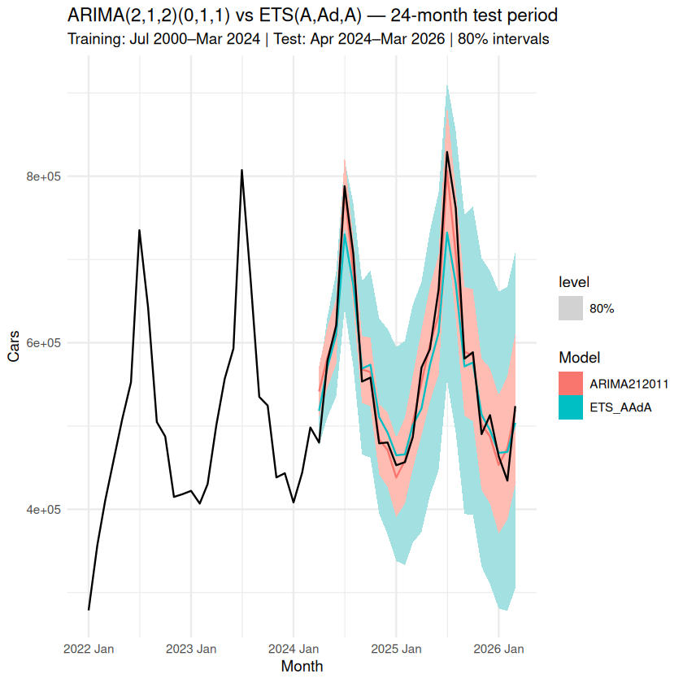
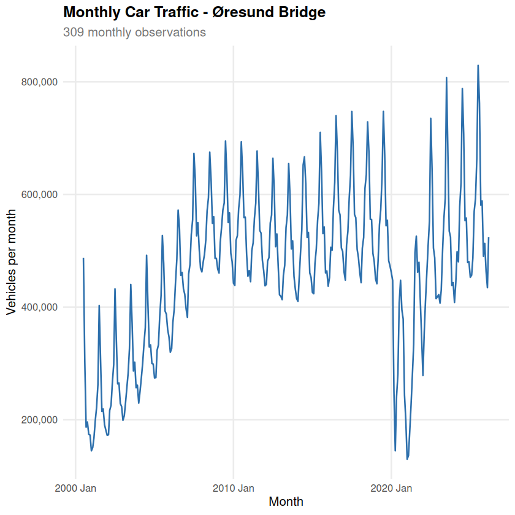
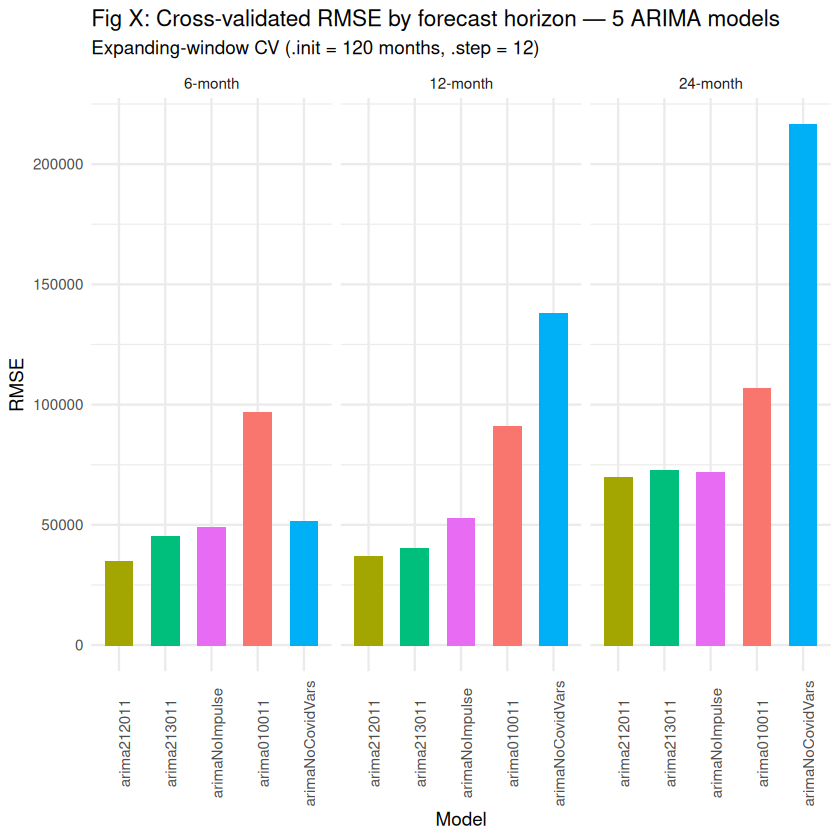

# Øresund Bridge Traffic Forecasting

Forecasting monthly car traffic across the Øresund Bridge (Copenhagen ↔ Malmö) with SARIMA and ETS models in R, including a COVID-19 structural break.

**Best model: regression with ARIMA(2,1,2)(0,1,1)₁₂ errors plus COVID intervention dummies, at 3.0% MAPE on a 24-month holdout (ETS: 4.7%).**



## Results

Holdout test: trained on Jul 2000 – Mar 2024, tested on Apr 2024 – Mar 2026.

| Model | RMSE | MAE | MAPE | MASE |
|---|---:|---:|---:|---:|
| **ARIMA(2,1,2)(0,1,1)₁₂ + COVID dummies** | **22,988** | **16,869** | **3.03%** | **0.36** |
| ETS(A,Ad,A) | 37,775 | 28,825 | 4.74% | 0.62 |

Expanding-window cross-validation (120-month initial window, 12-month step), RMSE by horizon:

| Model | 6 months | 12 months | 24 months |
|---|---:|---:|---:|
| **ARIMA(2,1,2)(0,1,1)₁₂ + COVID dummies** | **34,859** | **36,759** | **69,618** |
| ETS(A,Ad,A) | 36,873 | 109,407 | 162,367 |

The two models are close at 6 months, but ETS errors roughly triple at longer horizons, while the ARIMA model with COVID dummies stays stable.

## Key findings

1. **COVID has to be modelled explicitly.** A robust STL decomposition flags Mar 2020 – Jul 2021 as the outlier window (April 2020 sits 8σ below normal). Removing the COVID regressors raises the 12-month CV RMSE from 36.8k to 137.9k.
2. **The pandemic did not permanently change the series.** Chow (p = 0.81) and QLR / sup-F (p = 0.70) tests on the differenced series find no structural break, so dummies for the shock period are enough and no separate post-COVID regime is needed.
3. **Manual and automatic identification agree.** Reading the ACF/PACF and an exhaustive `ARIMA()` search both arrive at ARIMA(2,1,2)(0,1,1)₁₂, which passes the Ljung-Box test (p = 0.82). The simpler ARIMA(0,1,0)(0,1,1) leaves autocorrelation in the residuals (p = 0.03) and has 2.5× the 12-month CV error.
4. **Exchange rates don't drive crossings.** A DKK/SEK disparity regressor looks significant on the full sample (p = 0.003), but excluding 2008–2012 removes the effect (p = 0.13, AIC gain 0.5). The full-sample correlation came from the financial crisis alone. See [`exchange_rate_hypothesis.ipynb`](exchange_rate_hypothesis.ipynb).

<p align="center">
  
  
</p>

## Method

1. **Transformation:** Box-Cox with Guerrero's λ = 0.79 to stabilise the seasonal variance.
2. **Stationarity:** KPSS + ADF tests and `ndiffs`/`nsdiffs` → one seasonal and one first difference.
3. **COVID handling:** robust STL remainder z-scores to locate outliers, Chow and QLR tests for a structural break, then a COVID-period dummy plus impulse dummies for Mar, Apr and May 2020.
4. **Model search:** 5 ARIMA specifications (from ACF/PACF reading, `auto` ARIMA, and ablations without dummies) and 5 ETS / STL-ETS specifications.
5. **Validation:** Ljung-Box residual checks with the right degrees of freedom, expanding-window CV at 6, 12 and 24 months, and a final 24-month holdout.
6. **Forecast:** both best models refitted on all 309 months (Jul 2000 – Mar 2026), forecasting from Apr 2026.

## Repository

| File | Contents |
|---|---|
| [`oresund_traffic_forecasting.ipynb`](oresund_traffic_forecasting.ipynb) | Main analysis: data, transformation, COVID handling, ARIMA and ETS, CV, forecasts |
| [`exchange_rate_hypothesis.ipynb`](exchange_rate_hypothesis.ipynb) | Side analysis: does the DKK/SEK rate explain traffic? |
| `Trafficstat(EN).csv` | Monthly crossings by vehicle type, Jul 2000 – Mar 2026 (Øresundsbron traffic statistics) |
| `DKK_SEK Historical Data.csv` | Monthly DKK/SEK exchange rate |
| `figures/` | Figures used in this README |

## How to run

The notebooks use an R kernel ([IRkernel](https://irkernel.github.io/)).

```r
install.packages(c("tidyverse", "fpp3", "strucchange", "tseries", "patchwork", "IRkernel"))
IRkernel::installspec()
```

Then open `oresund_traffic_forecasting.ipynb` in Jupyter and run all cells.

## Context

Final exam project for *Predictive Analytics*, MSc Business Administration & Data Science, Copenhagen Business School (2026). Individual project.
